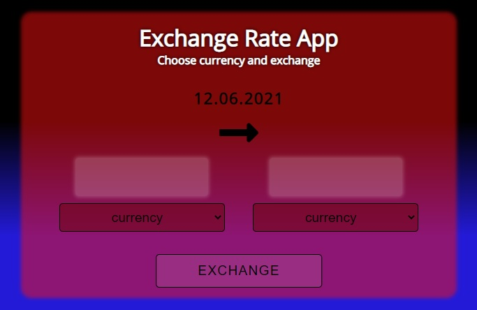

# CurrencyExchageApp

## Demo

[**click live demo of the project**](https://dominiksiejka.github.io/CurrencyExchangeApp)



## Table of Contents

- [About the Project](#description)
- [How to use](#how-to-use)
- [Technologies used](#built-with)
- [Setup steps](#setup)
- [Sources](#sources)
- [License](#license)

## Description

CurrencyExchangeApp it helps you to calculate the different currencies with the latest currency rate which is based on National Bank of Poland API. You can choose from three different currencies PLN, EUR and GBP

## How to use

First of all pick the base curreny on the left, then pick the currency you would like to exchange to. Next put the amount you would like to exchange and then press exchange button. On the right you will see the exchanged amount.

## Built with

- HTML5
- CSS
- Vanilla JavaScript
- used National Bank of Poland API

## Setup

```
with BASH

# clone the remote repo to your local one
$ git clone https://github.com/dominiksiejka/CurrencyExchangeApp.git

# open the index.html file or use your code editor to open it with live server

```

## Sources

- Icons from [Font Awesome ](https://fontawesome.com)
- Font from [Google Fonts ](https://fonts.google.com/)

## License

- MIT © [Dominik Siejka ](https://github.com/dominiksiejka/CurrencyExchangeApp)
